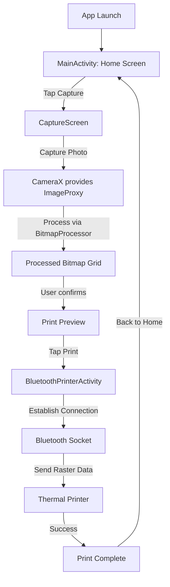

# OhShoot Android Project – Restart Guide

---

## 📖 Project Overview

**Repository:** `OhShoot` (Android Studio project)  
**Primary Language:** Kotlin  
**Key Features:**
- Captures images from the device camera.
- Processes bitmaps (resize, crop, add corner radius, decorative borders, combine into grids).
- Supports multiple layout types (`GRID_2X2`, `GRID_2X3`, `HYBRID`).
- Generates ESC/POS raster data for thermal printers.
- Bluetooth printer integration.
- Settings persistence via `AppSettings`.

The app follows a fairly **modular** structure – most core image‑processing logic lives in `BitmapProcessor.kt`, while UI screens, Bluetooth logic and camera handling are separated into their own Kotlin files.

---
## 📱 Main Features

- **Camera Capture** – Utilizes CameraX to capture high‑resolution images directly from the device.
- **Advanced Bitmap Processing** – Resize, crop, add corner radius, decorative borders, and combine images into configurable grid layouts.
- **Multiple Layout Types** – Supports `GRID_2X2`, `GRID_2X3`, and a hybrid layout, selectable at runtime.
- **ESC/POS Raster Generation** – Converts processed bitmaps to a 1‑bit raster format using Floyd‑Steinberg dithering for thermal printers.
- **Bluetooth Printing** – Sends raster data to ESC/POS‑compatible thermal printers via Bluetooth.
- **User Settings Persistence** – Stores printer MAC address, preferred layout, and other preferences using a dedicated settings module.

## 🔄 Application Lifecycle & App Flow

> **Note**: This section outlines the core Android activity/fragment lifecycle events relevant to OhShoot and provides a visual flow of user interactions from app launch to printing.

### 📂 High‑Level Lifecycle Overview

- **`MainActivity`** (launch activity) – *onCreate → onStart → onResume* → displays the **Home screen**.
- **`CaptureScreen`** (Compose/Fragment) – Handles camera initialization via **CameraX**. Lifecycle callbacks:
  - `onCreateView` – inflate UI, set up `CameraManager`.
  - `onResume` – bind camera use‑cases.
  - `onPause` – unbind to release camera resources.
- **`BluetoothPrinterActivity`** – Manages Bluetooth connection lifecycle:
  - `onCreate` – initialize `BluetoothPrinter` singleton.
  - `onStart` – check and request runtime permissions (`BLUETOOTH_CONNECT`, `BLUETOOTH_SCAN`).
  - `onDestroy` – close socket, clean up resources.
- **`BitmapProcessor`** – Stateless utility object; instantiated on‑demand, no lifecycle methods, but its functions must be called **off the UI thread** (e.g., via Kotlin coroutines) to avoid UI jank.

### 🚀 End‑to‑End App Flow



### 📌 Key Lifecycle & Flow Points

| Component | Critical Lifecycle Hook | Purpose | Risks & Mitigations |
|-----------|------------------------|---------|----------------------|
| `MainActivity` | `onResume` | Ensure UI is ready and permissions are checked. | Guard against missing Bluetooth/Camera permissions before navigation. |
| `CaptureScreen` | `onPause` / `onDestroy` | Release CameraX resources. | Prevent memory leaks by calling `cameraProvider.unbindAll()`. |
| `BluetoothPrinterActivity` | `onStart` | Request runtime permissions. | Handle denial gracefully – show fallback UI. |
| `BitmapProcessor` | N/A (stateless) | Perform heavy image work on `Dispatchers.IO`. | Avoid `NetworkOnMainThreadException` by using coroutines. |

> **Tip**: For a smoother user experience, consider moving the heavy bitmap processing into a WorkManager job if the app may be background‑ed during processing.

---

## ✅ What’s Good About This Project?

| Area | Strength |
|------|----------|
| **Code Organization** | Logic is encapsulated in purpose‑specific objects (`BitmapProcessor`, `CameraManager`, `BluetoothPrinter`). This reduces coupling and makes each component easier to reason about. |
| **Kotlin Language Features** | Use of top‑level `object`s, extension functions and Kotlin collections (`map`, `forEachIndexed`). The code is concise and leverages Kotlin’s expressive syntax. |
| **Bitmap Processing** | A solid set of reusable utilities (resize, crop, corner radius, border, grid composition). The dithered ESC/POS conversion is a sophisticated feature rarely seen in starter projects. |
| **Scalable Layout System** | `LayoutType` enum cleanly drives grid generation, allowing new layouts to be added with minimal changes. |
| **Gradle Build** | Uses the Kotlin DSL (`build.gradle.kts`) which keeps the build script type‑safe and IDE‑friendly. |
| **Version Control Ready** | `.git` directory present; typical Android files (`gradlew`, `settings.gradle.kts`) are correctly set up, enabling a straightforward `git clone && ./gradlew assembleDebug` workflow. |
| **Potential for UI/UX Enhancements** | The UI code already separates screens (`CaptureScreen.kt`) – this paves the way for a clean Jetpack Compose or XML‑based UI redesign. |

---

## ⚠️ Areas for Improvement

| Category | Issue | Suggested Remedy |
|----------|-------|-------------------|
| **Documentation** | No README, no developer onboarding guide. | Add a detailed `README.md` (project purpose, architecture diagram, build/run instructions). |
| **Error Handling** | Many functions assume non‑null inputs and ignore potential bitmap failures (e.g., `Bitmap.createBitmap` may throw). | Wrap risky calls in `try/catch`, return `Result` or sealed classes to convey success/failure. |
| **Unit Tests** | No test module present. | Create an `androidTest` and `test` source set; write JUnit tests for `BitmapProcessor` (e.g., verify dimensions after resize). |
| **Architecture** | UI logic lives directly in activities/fragments without clear MVVM or Clean Architecture separation. | Introduce ViewModel layer (`androidx.lifecycle.ViewModel`), repository pattern, and possibly DI (Hilt/Koin). |
| **Magic Numbers** | Hard‑coded percentages (5% border), contrast factor (1.4f), layout dimensions. | Extract constants into a well‑named `object` or `constants.kt` file; expose via configuration if needed. |
| **Accessibility** | No explicit handling of content descriptions, dynamic font sizing, or color contrast checks. | Use Android Accessibility guidelines; add `contentDescription` to UI elements, test with TalkBack. |
| **Resource Management** | Bitmaps can be large; there is no explicit recycling or `Bitmap` memory optimisation. | Use `Bitmap.recycle()` where appropriate, consider `inBitmap` reuse, and leverage `androidx.camera` for efficient streaming. |
| **Dependency Management** | No external libraries (e.g., Glide, Coil) for image loading/caching. | Evaluate adding an image‑loading library to simplify caching and handle lifecycle automatically. |
| **UI/UX Consistency** | UI screens are minimal; missing theming, dark‑mode support, and responsive layouts. | Adopt Material 3 theming, define a color palette, and test on multiple screen sizes. |
| **Code Comments** | Some functions lack KDoc; internal calculations are not explained. | Add KDoc comments describing parameters, return values, and algorithmic choices (especially the Floyd‑Steinberg dithering). |
| **Security** | Bluetooth pairing logic may lack permission handling for newer Android versions. | Verify runtime permissions (`BLUETOOTH_CONNECT`, `BLUETOOTH_SCAN`) and add graceful fallback for denied permissions. |

---

## 🛠️ Step‑by‑Step Restart Guide

1. **Prerequisites**
   - Install **Android Studio Flamingo** (or newer) with the **Kotlin** plugin.
   - Ensure the **Android SDK** platform‑tools are up‑to‑date (API 33+ recommended).
   - On Windows, add `c:\Users\Gloria\AndroidStudioProjects\OhShoot` to your `PATH` if you plan to run Gradle from a terminal.

2. **Clone the Repository**
   ```bash
   git clone https://github.com/your‑org/OhShoot.git
   cd OhShoot
   ```

3. **Sync Project**
   - Open the folder in Android Studio → *File → Sync Project with Gradle Files*.
   - If Gradle prompts for a missing JDK, point it to your local JDK (11+).  
   - Resolve any version mismatches (`build.gradle.kts` already uses the Kotlin DSL, but you may need to update the Gradle wrapper: `./gradlew wrapper --gradle-version 8.5`).

4. **Add Required API Keys / Config**
   - The app expects a `local.properties` entry for the Android SDK location:
     ```properties
     sdk.dir=C:\Users\Gloria\AppData\Local\Android\sdk
     ```
   - If the Bluetooth printer requires a MAC address, create a `res/values/strings.xml` entry:
     ```xml
     <string name="printer_mac">00:11:22:33:44:55</string>
     ```

5. **Build & Run**
   ```bash
   ./gradlew assembleDebug   # Windows: .\gradlew.bat assembleDebug
   ```
   - Connect an Android device or start an emulator (API 33).  
   - Run from Android Studio: *Run → app*.

6. **Verify Core Functionality**
   - Capture a photo via the **CaptureScreen**.
   - Confirm that the bitmap appears correctly in the grid preview.
   - Test Bluetooth printing (ensure the device is paired).  
   - If the printer does not respond, enable verbose logging in `BluetoothPrinter.kt` (add `Log.d(TAG, "debug info")`).

7. **Run Unit Tests (once added)**
   ```bash
   ./gradlew test   # Executes JVM tests
   ./gradlew connectedAndroidTest   # Executes instrumented tests on a device/emulator
   ```

8. **Future Enhancements Checklist** (use this as a living document)
   - [ ] Add a comprehensive `README.md` with screenshots.
   - [ ] Implement MVVM architecture with ViewModels.
   - [ ] Write unit tests for `BitmapProcessor`.
   - [ ] Introduce a theming system (Material 3, dark mode).
   - [ ] Add accessibility labels and test with TalkBack.
   - [ ] Replace manual bitmap handling with an image‑loading library.
   - [ ] Harden Bluetooth permission handling for Android 12+.

---

## 🎨 UI/UX Recommendations (Optional)

- **Color Palette:** Use a calming teal‑blue (`#006d77`) complemented by soft gray (`#f0f0f0`).
- **Typography:** Pair *Inter* for body text with *Roboto Slab* for headings.
- **Interaction States:** Add ripple feedback on capture button and a subtle elevation change on grid tiles.
- **Dark Mode:** Invert the white canvas background to `#121212` and adjust border colors accordingly.

---

## 📄 Page-by-Page Feature Overview

### Home Screen (`MainActivity`)

- **Sections**: Header with app title, preview of last printed image, navigation buttons.
- **Buttons**:
  - **Capture** – Navigates to CaptureScreen.
  - **Settings** – Opens Settings screen.
  - **Print History** – Shows list of previously printed images.
- **Contents**:
  - App logo.
  - Quick‑action tiles.

### Capture Screen (`CaptureScreen`)

- **Sections**: Camera preview, control panel.
- **Buttons**:
  - **Capture Photo** – Takes a picture.
  - **Switch Camera** – Toggles front/rear.
  - **Flash** – Toggles flash mode.
  - **Cancel** – Returns to Home.
- **Contents**:
  - Live CameraX preview.
  - Overlay grid guide.
  - Capture button with ripple effect.

### Print Preview Screen (`PrintPreviewFragment`)

- **Sections**: Processed bitmap grid preview, printer selection.
- **Buttons**:
  - **Print** – Starts Bluetooth printing.
  - **Edit** – Returns to Capture to retake/reprocess.
  - **Back** – Returns to Home.
- **Contents**:
  - Grid layout showing processed images.
  - Selected layout type indicator.
  - Estimated print size.

### Bluetooth Printer Activity (`BluetoothPrinterActivity`)

- **Sections**: Device list, connection status.
- **Buttons**:
  - **Connect** – Initiates socket connection.
  - **Disconnect** – Closes connection.
  - **Resend** – Sends the raster data again.
- **Contents**:
  - List of paired Bluetooth printers.
  - MAC address display.
  - Connection status indicator.

### Settings Screen (`SettingsActivity`)

- **Sections**: Preference groups (Printer, Layout, Theme).
- **Controls**:
  - **Save** – Persists changes.
  - **Reset** – Restores defaults.
- **Contents**:
  - Text field for printer MAC.
  - Dropdown for default layout type.
  - Switch for Dark Mode.

---

## 📦 Dependencies Overview

| Dependency | Current Status | Recommendation |
|------------|----------------|----------------|
| AndroidX Core | ✅ Up‑to‑date | Keep updated. |
| Kotlin Stdlib | ✅ | ✅ |
| None for image loading | ❌ | Add **Coil** (`implementation "io.coil‑kt:coil:2.5.0"`). |
| Bluetooth support | ✅ | Verify compatibility with Android 13 API changes. |

---

## 📝 Closing Remarks

The **OhShoot** project is a solid foundation for a photo‑capture and printing app. Its core bitmap utilities are well‑crafted, but the surrounding ecosystem (documentation, testing, architecture, UI polish) still needs attention. Follow the steps above to get the project up and running quickly, then gradually address the improvement checklist to evolve the app into a production‑ready solution.

## 🚀 Efficient Project Recreation Tips

- **Start from a clean template**: Use Android Studio's "Empty Activity" with Kotlin and enable Jetpack Compose or XML as preferred. This gives you a standardized project structure.
- **Modularize early**: Split the app into Gradle modules (`:app`, `:core`, `:feature:camera`, `:feature:printing`). This isolates dependencies and speeds up incremental builds.
- **Adopt a clean architecture**: Scaffold ViewModel, Repository, and Use‑Case layers (e.g., using the `androidx.lifecycle` and `kotlinx.coroutines` libraries). This reduces coupling and makes future refactors easier.
- **Automate setup with scripts**:
  - Create a `setup.bat`/`setup.sh` that runs `git clone`, installs the required SDK, and executes `./gradlew clean assembleDebug`.
  - Use `./gradlew wrapper --gradle-version 8.5` to ensure consistent Gradle version.
- **Leverage CI/CD**:
  - Define a GitHub Actions workflow to run lint, unit tests, and build APKs on every push.
  - Use Fastlane to automate signing and publishing to internal testing tracks.
- **Use dependency injection**: Integrate Hilt or Koin from the start to manage services like `BluetoothPrinter` and `CameraManager`. This cuts boilerplate and eases testing.
- **Version‑controlled configuration**:
  - Store SDK paths and printer MAC addresses in `local.properties` and `gradle.properties` with placeholders.
  - Keep secrets out of source control (use `.env` files or GitHub Secrets for CI).
- **Documentation as code**:
  - Keep the restart guide in the repository (`PROJECT_RESTART_GUIDE.md`) and generate API docs with Dokka.
  - Add a `README.md` with badges for CI status, coverage, and app version.
- **Testing strategy**:
  - Write unit tests for pure Kotlin logic (`BitmapProcessor`) and instrumentation tests for UI flows.
  - Use Robolectric for fast JVM tests of ViewModel logic.

*Generated on 2026‑06‑20 by Antigravity.*
